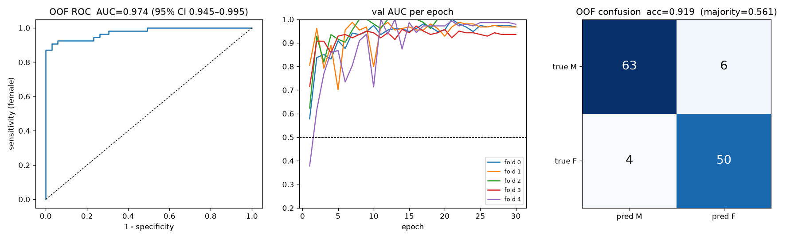
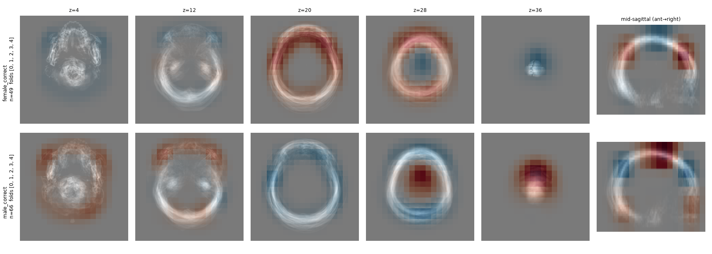

# 頭部 CT 顱骨形態 CNN：性別分類與年齡迴歸——從一個失敗的 pilot 到可信的評估

> 3D CNN 從非顯影頭部 CT 判斷性別的小型研究。第一版（2026 年 1 月）報出 76% 準確率，後來發現那個數字等於「全部猜男性」；第二版（2026 年 9 月）重做前處理與評估方式，只用顱骨（去掉軟組織、頭髮、頭架）得到 5-fold out-of-fold **AUC 0.974（95% CI 0.945–0.995）**，換 seed 重跑為 0.976，並用四個檢查排除了洩漏與捷徑。這份 README 記錄兩版之間的差異，以及我從中學到的東西。同一套 pipeline 換成年齡迴歸的延伸見 [§9](#9-延伸年齡迴歸age) 與 [`age/`](age/README.md)。

作者：CHIH HSING TANG｜資料來源：NTUH

開發方式：程式與 LLM 協作撰寫（Claude Code）；研究問題、資料排除、評估方式、結果解讀與所有決策由作者負責，逐日紀錄見 `WORKLOG.md`。
---

## 1. 問題與資料

**任務**：給一張非顯影腦部 CT（5 mm 厚切，約 30 張），預測病人性別。顱骨的性別二態性（眉弓、乳突、枕外隆凸、下頜角等）是法醫人類學的既有知識，這裡想知道一個小型 3D CNN 能不能從常規厚切 CT 學到它。

**資料**：

| 項目 | 數值 |
|---|---|
| 來源 | 單一機構常規 brain CT，2026-01-01 至 01-09 |
| 原始例數 | 133 例（有性別與年齡標籤） |
| 排除 | 未成年 7 例（8–17 歲；青春期前二態性未成形）、顱面大範圍異常 1 例、掃描方向不同（sagittal 厚切）2 例 |
| 納入 | **123 例：男 69、女 54**，年齡 18–96 歲；男女年齡中位數皆 68（Mann-Whitney p = 0.92） |
| 掃描參數 | 面內 0.26–0.53 mm、層厚 4.4–7 mm（94% 為 5 mm）、矩陣 378×490 到 954×990 不等 |

沒有獨立的外部測試集。所有結果都是 5-fold cross-validation 的 out-of-fold 估計。

---

## 2. 方法（v2）

### 2.1 前處理（`preprocess.py`）

只做幾何，不做強度正規化：

1. 轉 RAS 方向
2. 在世界座標重取樣到 **1 × 1 × 5 mm**（保留原始層厚，不合成切片；軸序不一致的病例由 affine 自動處理）
3. 以骨組織（> 300 HU）bounding box 的中心裁切／補氣到 **240 × 240 × 40**
4. 存 int16 HU，檔名改為匿名 ID（`skull_001`…）

輸出每例同 spacing、同 shape、同 orientation，附一張 133 例的 contact sheet 供目視 QA（`results/qa_contact_sheet.png`）。任何一例讀檔失敗或找不到骨組織就中止，不靜默跳過。

### 2.2 模型與訓練（`train_cv.py`）

| 項目 | 設定 |
|---|---|
| 網路 | DenseNet121-3D（MONAI），11.2 M 參數，從頭訓練 |
| 輸入 | **純顱骨版（主結果）**：只保留 > 300 HU 的最大連通元件（顱骨；頭架、耳環、碎片為分離元件），window [300, 1300] → [0, 1]。**全頭部版（對照）**：不做 mask，骨窗 [−500, 1300] |
| 增強 | 左右翻轉（p = 0.5）、隨機平移 ≤ 8 / 8 / 2 voxel |
| 損失／優化 | BCEWithLogits、AdamW（lr 1e-4, wd 1e-4）、cosine schedule |
| Batch / epoch | 4 / 30 |
| 種子 | 42 |

### 2.3 評估

- **StratifiedKFold 5 折**，每折固定跑 30 epoch，取**最後一個 epoch** 的驗證集預測。不用驗證集挑「最好的 epoch」——沒有獨立測試集時，那樣做等於用測試資料選模型。
- 123 例的 out-of-fold 預測合併後算 **AUC**，95% CI 用 bootstrap（2000 次）。
- 同時報各折 AUC 的平均 ± SD、accuracy（閾值 0.5）、sensitivity（女）、specificity（男）。
- 每個數字旁邊放 **majority baseline**（全猜男 = 69/123 = 56.1%）。
- 另跑一個**尺寸 baseline**（`size_baseline.py`）：只用顱骨大小做 logistic regression，fold 切法與 CNN 完全相同。用來回答「模型是不是只學到頭大 = 男」。

---

## 3. 結果（v2）

### 3.1 主結果

123 例、5-fold out-of-fold：

| | AUC（95% CI） | 各折 AUC | Accuracy | Sens（女） | Spec（男） |
|---|---|---|---|---|---|
| **純顱骨 CNN（主結果，seed 42）** | **0.974（0.945–0.995）** | 0.968 / 0.968 / 1.000 / 0.936 / 0.979（0.970 ± 0.021） | 0.919 | 0.926 | 0.913 |
| 純顱骨 CNN，seed 43（重複） | 0.976（0.953–0.993） | 0.994 / 0.981 / 1.000 / 0.914 / 0.958（0.969 ± 0.031） | 0.902 | 0.907 | 0.899 |
| 全頭部 CNN（對照） | 0.987（0.971–0.997） | 0.987 / 0.981 / 1.000 / 0.993 / 0.993（0.991 ± 0.007） | 0.935 | 0.889 | 0.971 |
| 尺寸 baseline（LR，4 個尺寸特徵） | 0.77（0.69–0.85） | — | 0.73 | — | — |
| Majority（全猜男） | 0.5 | — | 0.561 | 0 | 1 |



純顱骨版（seed 42）的混淆矩陣（列 = 真實，欄 = 預測）：男 63 / 6、女 4 / 50。判錯 10 例；全頭部版判錯 8 例，其中 6 例兩版都錯——兩版看的是同一種訊號。

**換 seed 重跑**（seed 43：折的切法與初始權重都不同）：AUC 0.976，兩 seed 平均 0.975 ± 0.001；兩 seed 對同一人的 p(女) 相關係數 0.926。判錯病例重疊 5 例（`skull_046`、`088`、`099`、`114`、`121`），這 5 例在全頭部版也錯——三個 run 都判錯，是模型穩定看不懂的病例，不是隨機錯。

### 3.2 尺寸 baseline：頭大小能解釋多少？

只用四個尺寸特徵（骨體素數、骨組織 bounding box 的 x／y／z 長度）做 logistic regression，同樣的 5 折：

| 特徵 | OOF AUC（95% CI） | Accuracy |
|---|---|---|
| 骨體素數 | 0.61（0.51–0.71） | 0.59 |
| bbox x／y／z | 0.77（0.69–0.85） | 0.71 |
| 四項合併 | 0.77（0.69–0.85） | 0.73 |

男性平均比女性大約 5%（骨體素數 +5.3%、前後長 +4.8%、含骨切片數 +5.5%、左右寬 +1.9%）。尺寸本身有 0.77 的 AUC，CNN 的 0.974 明顯高於此，CI 不重疊——模型用到的不只是大小。

注意：bbox z 是「掃描範圍內有骨頭的切片數」，由技師設定的掃描範圍決定，不是純解剖量測。

### 3.3 這個數字可信嗎：四個檢查

AUC 0.97 對 5 mm 厚切、123 例的資料來說高得需要懷疑。依序排除：

| 質疑 | 檢查方法 | 結果 |
|---|---|---|
| 過擬合？ | 看 held-out 折的表現 | 每折 val AUC 0.936–1.000；過擬合的症狀是 val 差，這裡相反 |
| 資料洩漏（程式 bug）？ | 把標籤隨機打亂，同設定重訓一折 10 epoch | val AUC 0.31–0.57，最後 0.43；同一折真標籤第 10 epoch 為 0.91。有洩漏的話打亂後仍會高 |
| 掃描協定捷徑？ | 各 metadata 單獨對性別的 AUC | 面內 spacing 0.58、層厚 0.55、矩陣 0.55–0.56、FOV 0.60–0.62、日期 0.51；含骨切片數 0.71（＝ bbox z） |
| 頭髮／軟組織／耳環捷徑？ | 只保留顱骨最大連通元件重跑 | 0.987 → 0.974，CI 大幅重疊；判錯病例 6/8 重疊 |

標籤打亂與 metadata 檢查是在全頭部設定下做的；純顱骨版是在這兩項通過之後才跑。

### 3.4 模型看顱骨的哪裡：occlusion sensitivity

五折各自重訓一次純顱骨模型（與主結果同設定、同切分），對每折的 held-out 病例用 24 × 24 × 40 mm 的遮罩逐位置換成空氣、只遮含骨的位置（每例約 1,200–1,300 次），量 logit 變化。importance = 遮掉後真實類別的證據減少多少。五折合計 123 例，115 例判對，以下只看判對的。

正 importance 的空間分布（y 前後 × z 上下，各三等分；五折合併值）：

| | 後 | 中 | 前 | 該層合計 |
|---|---|---|---|---|
| **女性（n = 49）** 顱頂 | 0.09 | 0.13 | 0.17 | 0.40 |
| 　中 | 0.09 | 0.26 | 0.24 | 0.60 |
| 　顱底 | 0.00 | 0.01 | 0.00 | **0.01** |
| **男性（n = 66）** 顱頂 | 0.00 | 0.31 | 0.06 | 0.38 |
| 　中 | 0.03 | 0.02 | 0.08 | 0.12 |
| 　顱底 | 0.12 | 0.15 | 0.22 | **0.50** |

各折分開算的九宮格在 `results/occlusion_pooled/occ_pooled_summary.json`；關鍵格子五折一致（女性顱底三格每折皆 ≤ 0.04；男性顱底前方每折 0.18–0.24）。



- 女性證據 99% 在中層與顱頂（額、頂骨），顱底幾乎為零；頭頂中央是反向證據。
- 男性證據一半在顱底層（前方眶上／額區 0.22、後方枕／乳突區 0.12），另外 0.31 在頭頂；**中上顱頂對男性是反向證據**——遮掉反而更像男。
- 兩性的圖幾乎互為反色：同一個區域對一性是證據、對另一性是反證。模型學到的是一組連續的形態軸，不是兩套獨立特徵。

模型把顱底層的前後兩端當男性證據、把圓滑的中上顱頂當女性證據。位置上與經典二態性特徵（眉間／眉弓、乳突、枕外隆凸）的分布一致，但遮罩是 24 × 24 × 40 mm，只能說「區域一致」，不能說模型辨認了特定結構。頭頂的男性證據可能反映顱高（尺寸）。

先前嘗試 Grad-CAM（denseblock2）失敗：空氣區的 CAM 飽和在最大值（男性病例 57–74% 體素），顱骨反而低——3D 大面積 padding 下的已知假象，該結果未採用。

### 3.5 解讀

- 純顱骨 0.974 是主結果；全頭部 0.987 高 0.013，差距在 CI 內，軟組織和頭髮提供的是輔助線索，不是主訊號。
- 模型學到的不只是尺寸（0.77），五折 occlusion 一致顯示它同時用了顱底層前後的形態與顱頂形狀。
- 五折之間純顱骨版的變異（SD 0.021–0.031）大於全頭部版（0.007），兩個 seed 各有一折在 0.91–0.94；123 例的資料，這個程度的折間差異是預期的。換 seed 後 OOF AUC 只差 0.002，整體估計是穩的。
- 這些數字是單一機構、單一時段、5 mm 厚切的 CV 估計，沒有外部驗證（§5）。

---

## 4. v1 → v2：第一版哪裡錯了

這是我認為這個專案最有價值的部分。v1 從 2026-01-06 做到 01-26，版本號跑到 v8、留下 12 個 checkpoint，報出的驗證準確率最高 76.19%。以下是我回頭檢查時找到的問題。

### 4.1 結果面

| 發現 | 證據 | 後果 |
|---|---|---|
| 驗證準確率是 majority-class 分數 | 76.19% = 16/21、71.43% = 15/21，30 個 epoch 只在這幾個「21 分之幾」之間跳；同時訓練準確率只有 51–68%，val 一直高於 train | 模型退化成固定輸出「男」，數字沒有意義 |
| 真實混淆矩陣比 baseline 差 | 01-16 產出的混淆矩陣（31 例驗證集）：男 17/23、女 4/8，整體 67.7%；全猜男是 74.2% | 女性 4/8 等於擲銅板 |
| 「盲測」不是盲的 | 盲測程式取的是訓練池最後 15 筆；獨立的 blind_test 資料夾是 DICOM，讀取程式找不到檔案就結束了 | v1 沒有任何 held-out 結果 |
| 跨版本驗證集洩漏 | v6 → v7 → v8 每版載入前版權重，但 train/val 每版重新隨機切分 | 後期版本的驗證集包含前期的訓練資料 |

### 4.2 方法面

| 問題 | v1 做法 | 後果 | v2 修正 |
|---|---|---|---|
| 形態被拉扯 | 各軸獨立 zoom 到 (512, 512, 32)，原始矩陣 378×490 到 954×990 不等 | 每個人被拉成不同比例，voxel spacing 丟失——形態學分類卻破壞了形態訊號 | 世界座標重取樣到固定 spacing，中心裁切 |
| 強度不一致 | 逐例 min-max（`ScaleIntensityd`） | 6 例含金屬（HU max 5,000–17,500），這些人的骨頭被壓到 0.06，其他人在 0.5 | 固定 HU 骨窗 |
| 未成年混入 | 8–17 歲 7 例在訓練集 | 青春期前顱骨二態性未成形，標籤本身是雜訊 | 排除 |
| 讀檔失敗靜默 | `except: return zeros` | 可能有全黑影像配真標籤在訓練，且不會被發現 | 失敗即中止 |
| 模型太小 | 兩層 Conv3d + AdaptiveAvgPool，約 14 萬參數；12 個 checkpoint 名稱從 v4 到 v8_A100 但架構全部相同 | 看不出顱骨細部形態 | MONAI DenseNet121-3D |
| 單次切分 | 80/20 一次，驗證集 16–31 人 | 一個人翻盤就差 3–6% | 5-fold CV + bootstrap CI |
| 用驗證集選模型 | 每 epoch 存「最佳」val acc 的權重 | 報出的數字是 31 次抽樣的最大值 | 固定 epoch，取最後一個 |

### 4.3 一句話總結

v1 不是「準確率不夠高」，是**整條 pipeline 沒有一個環節能產出可信的數字**。修正之後即使 AUC 沒有變得很漂亮，至少它是真的。

---

## 5. 限制與下一步

- **樣本小、切片厚**：123 例、5 mm 厚切，AUC 的 CI 必然很寬。這是資料的上限。
- **沒有外部驗證**：單一機構、單一時段。
- **沒有跟傳統方法比**：法醫人類學用形態量測（如眉弓突出度、乳突大小）做性別判定已有成熟的準確率。一個公平的 baseline 應該是從同一批 CT 量幾個標誌點做 logistic regression。這是下一步。
- **可解釋性的解析度**：遮罩 24 × 24 × 40 mm 無法指認具體解剖結構；occlusion 用的五個模型是重訓的，與主結果的五個模型不是同一組權重（同設定、同切分，但 MPS 非確定性）。
- **年齡**：本樣本男女年齡分布相同（中位數皆 68，p = 0.92），年齡不是這批資料的混淆因子。年齡本身能不能從同一批影像預測，見 §9。
- **未檢查的捷徑**：頭架位置、金屬（牙科／手術）、掃描機型與性別的關聯未逐一排除；純顱骨版已移除頭架與耳環，但顱骨內的金屬（如手術夾）仍在。

---

## 6. 重現

```bash
python -m venv .venv && source .venv/bin/activate
pip install -r requirements.txt

# 1. 前處理（輸入：nifti_data/<filename>.nii.gz + labels_cleaned.csv［欄位 filename,gender,age］→ 輸出：preprocessed/）
python preprocess.py

# 2. 5-fold CV（每版約 2.5 h on Apple M4 Pro / MPS；A100 更快）
python train_cv.py --data preprocessed --out results/v2_bone_only --bone_only   # 主結果
python train_cv.py --data preprocessed --out results/v2_bone_only_seed43 --bone_only --seed 43   # 換 seed 重複
python train_cv.py --data preprocessed --out results/v2_run1                     # 全頭部對照

# 2b. 標籤打亂 sanity check（1 折 10 epoch，約 11 min）
python sanity_shuffle.py --data preprocessed --epochs 10

# 4. 可解釋性：每折重訓純顱骨模型並存權重（32 min），再做 occlusion（32 min），最後合併
for k in 0 1 2 3 4; do
  python explain.py --data preprocessed --out results/explain_fold$k --fold $k
  python occlusion.py --data preprocessed --model results/explain_fold$k/model.pt --fold $k --out results/occlusion_fold$k
done
python occlusion_pool.py --folds 0 1 2 3 4 --out results/occlusion_pooled

# 3. 尺寸 baseline（< 1 分鐘）
python size_baseline.py --data preprocessed --out results/size_baseline

# 只驗證程式能跑（12 例、2 折、2 epoch，< 1 分鐘）
python train_cv.py --data preprocessed --out results/smoke --smoke
```

本 repo **不含影像資料與模型權重**。`preprocessed/labels_anon.csv` 的格式如下，自備資料時照這個格式即可：

```
case_id,gender,age,exclude
skull_001,0,46,
skull_002,0,83,
```
（gender：0 = 男、1 = 女；exclude 非空白即排除）

---

## 7. 檔案

```
README.md
requirements.txt
preprocess.py          v2 前處理（幾何）
train_cv.py            v2 訓練＋評估；--bone_only 為主結果設定
size_baseline.py       尺寸 baseline（§3.2）
sanity_shuffle.py      標籤打亂檢查（§3.3）
explain.py             重訓指定折並存權重；含已作廢的 Grad-CAM（§3.4）
occlusion.py           occlusion sensitivity，單折（§3.4）
occlusion_pool.py      合併多折 occlusion（§3.4）
results/
  v2_bone_only/        主結果：metrics.json, oof_predictions.csv, history.csv, summary.png
  v2_bone_only_seed43/ 換 seed 重複：同上
  v2_run1/             全頭部對照：同上
  size_baseline/       metrics.json
  sanity_shuffle.txt   打亂標籤的逐 epoch 紀錄
  occlusion_fold{0-4}/ 各折 occ_summary.json, occ_mean.png, occ_examples.png
  occlusion_pooled/    五折合併 occ_pooled_summary.json, occ_pooled_mean.png
  qa_contact_sheet.png 前處理後 133 例縮圖
  v1_final_report_cm.png   v1 真實混淆矩陣（§4.1）
v1/
  modules/             v1 的 model.py / data_utils.py / trainer.py，原樣保留供對照
  training_history.csv, v7_training_history.csv, v8_training_history.csv
WORKLOG.md             逐日決策紀錄
age/
  README.md            年齡迴歸延伸（§9）
  train_age_cv.py      5-fold CV 年齡迴歸
  feature_baseline.py  尺寸＋骨 HU ridge baseline
  results/             age_fullhead/, age_bone_only/（metrics.json, history.csv, summary.png）, feature_baseline/
```

不含：影像、DICOM、`labels_anon.csv`（病例層級的性別／年齡）、`manifest.csv`（原始檔名對照）、模型權重、occlusion 的體素級 map（115 MB）、年齡模型的逐例預測（含病例層級年齡）。

---

## 8. 資料

- 影像、DICOM、標籤對照表、模型權重皆不在本 repo。
- 前處理輸出使用匿名 ID，NIfTI header 為全新建立，不含任何原始 DICOM 欄位。

---

## 9. 延伸：年齡迴歸（`age/`）

同 123 例、同前處理、同 DenseNet121-3D、同訓練設定，只把標籤換成年齡、BCE 換成 L1、分折改依年齡分箱。目的是看厚切常規 CT 有沒有可學習的年齡訊號，以及訊號在不在顱骨本身。完整說明、各年齡層偏差表與圖見 [`age/README.md`](age/README.md)。

| | MAE（歲） | 95% CI | r |
|---|---|---|---|
| 猜訓練折平均 | 15.83 | — | — |
| 骨平均 HU ridge（骨密度代理） | 14.38 | 12.5–16.4 | 0.31 |
| **CNN 全頭部** | **11.10** | 9.6–12.7 | **0.68** |
| **CNN 純顱骨** | **12.66** | 10.9–14.5 | 0.57 |

- 有訊號：兩個 CNN 的 CI 上界都低於猜平均；顱骨大小對年齡無用（r −0.06），與性別相反。
- **性別是骨頭的事，年齡不只是**：去掉軟組織與顱內鈣化，性別只掉 0.013 AUC（§3.5），年齡卻退 1.6 歲、r 從 0.68 掉到 0.57。
- 不可用的地方要講清楚：預測往均值收縮，18–39 歲（12 例）被高估 18 歲、80 歲以上被低估 10 歲。
- 限制：單一 seed、無可解釋性、無外部驗證；瓶頸在資料（樣本偏老、5 mm 厚切），不在模型。
