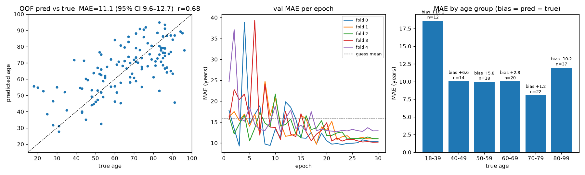
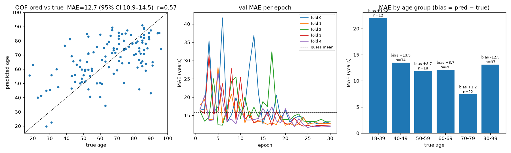

# 顱骨 CT 年齡迴歸：同一套 pipeline 換一個任務

> 延伸自 [主專案](../README.md)（顱骨性別分類）。同 123 例、同前處理、同網路、同訓練設定，只把標籤從性別換成年齡、把分類頭換成迴歸。目的不是做出可用的年齡估計器，而是回答兩個問題：常規 5 mm 厚切 CT 有沒有可學習的年齡訊號？訊號在顱骨本身，還是在顱骨以外？

---

## 1. 資料

與性別模型完全相同的 123 例（排除 <18 歲 7 例、顱面異常 1 例、sagittal 厚切 2 例），年齡 18–96 歲，平均 65.5、SD 18.8。分布偏老：

| 年齡 | 18–39 | 40–49 | 50–59 | 60–69 | 70–79 | 80–99 |
|---|---|---|---|---|---|---|
| n | 12 | 14 | 18 | 20 | 22 | 37 |

男女年齡分布相同（65.6 vs 65.3），年齡模型不會偷用性別訊號。

## 2. 方法：與性別模型的差異

| | 性別（train_cv.py） | 年齡（train_age_cv.py） |
|---|---|---|
| 標籤 | 0/1 | 歲數，以訓練折 mean/SD 標準化後回推 |
| 損失 | BCEWithLogits | L1 |
| 分折 | 依性別 stratified | 依年齡五分位分箱 stratified |
| 指標 | AUC + bootstrap CI | MAE / RMSE / Pearson r + bootstrap CI |
| Baseline | majority、顱骨尺寸 logistic | 猜訓練折平均、顱骨尺寸＋骨平均 HU ridge |
| 額外報告 | sens / spec | 各年齡層 MAE 與偏差（pred − true） |

其餘不變：DenseNet121-3D（MONAI）、240×240×40 @ 1×1×5 mm、AdamW 1e-4、30 epoch、batch 4、左右翻轉＋≤8/8/2 voxel 平移、固定 epoch 數不用 val 挑模型、5-fold out-of-fold 估計。兩個設定各跑一次（seed 42）：

- **全頭部**：HU 窗 [−500, 1300]，含軟組織、顱內鈣化
- **純顱骨**：只保留 >300 HU 最大連通元件，窗 [300, 1300]。注意這會把顱內鈣化（頸動脈虹吸部、松果體、脈絡叢）一併移除

## 3. 結果

### 3.1 主表（123 例，5-fold OOF）

| | MAE（歲） | 95% CI | RMSE | r | 各折 MAE |
|---|---|---|---|---|---|
| 猜訓練折平均 | 15.83 | — | — | — | — |
| 顱骨尺寸四項 ridge | 16.07 | 14.2–18.1 | — | −0.06 | — |
| 骨平均 HU ridge | 14.38 | 12.5–16.4 | — | 0.31 | — |
| **CNN 全頭部** | **11.10** | 9.6–12.7 | 14.0 | **0.68** | 10.4 / 11.0 / 11.0 / 10.2 / 12.9 |
| **CNN 純顱骨** | **12.66** | 10.9–14.5 | 16.1 | 0.57 | 12.9 / 12.8 / 13.3 / 12.4 / 12.0 |




### 3.2 各年齡層偏差（pred − true，歲）

| 真實年齡 | n | 全頭部 MAE（偏差） | 純顱骨 MAE（偏差） |
|---|---|---|---|
| 18–39 | 12 | 18.6（**+18.1**） | 22.0（**+19.2**） |
| 40–49 | 14 | 10.1（+6.6） | 13.5（+13.5） |
| 50–59 | 18 | 10.0（+5.8） | 11.9（+8.7） |
| 60–69 | 20 | 10.0（+2.8） | 12.1（+3.7） |
| 70–79 | 22 | 8.1（+1.2） | 7.4（+1.2） |
| 80–99 | 37 | 12.0（**−10.2**） | 13.1（**−12.5**） |

### 3.3 解讀

- **厚切常規 CT 有可學習的年齡訊號。** 兩個 CNN 的 CI 上界都低於猜平均，也壓過骨密度代理（骨平均 HU 與年齡 r = −0.33）。顱骨大小對年齡完全沒用（r −0.06），與性別相反。
- **年齡訊號不只在顱骨。** 去掉軟組織與顱內鈣化後 MAE 退 1.6 歲、r 從 0.68 掉到 0.57；性別模型做同樣的事只掉 0.013 AUC。性別是骨頭的事，年齡有一塊在顱骨以外（顱內鈣化是最可能的來源，未驗證）。
- **典型的迴歸均值。** 年輕人被猜老、80 歲以上被猜年輕，預測往 65 歲收縮；純顱骨版更嚴重。40 歲以下只有 12 例，兩個版本在這個年齡層都不可用。
- 學習曲線前 15–20 epoch 各折震盪大（val MAE 一度 20–40），30 epoch 才穩；純顱骨版震盪更劇烈。

## 4. 限制

- 單一 seed（性別模型跑了兩個）；沒做可解釋性；沒有外部驗證。
- 樣本偏老、5 mm 厚切：縫合線、板障、鼻竇等年齡線索多在 1 mm 尺度，厚切看不到。
- 「顱內鈣化是年齡訊號來源」是推論，沒有直接驗證（要做需第三個設定：遮掉顱骨只留顱內）。
- 瓶頸在資料（樣本數、年齡分布、層厚），不在模型。要把 MAE 從 11 拉到個位數，需要上千例、各年齡層均衡、薄切骨 kernel 重組。

## 5. 重現

```bash
# 環境與前處理輸出同主專案（見 ../README.md §6）；在 age/ 目錄下執行
# 每個設定 5 折 30 epoch 約 2.7 h on Apple M4 Pro / MPS（64 s/epoch）
python train_age_cv.py --data ../preprocessed --out results/age_fullhead
python train_age_cv.py --data ../preprocessed --out results/age_bone_only --bone_only
python feature_baseline.py --data ../preprocessed --out results/feature_baseline      # < 1 分鐘
python train_age_cv.py --data ../preprocessed --out results/smoke --smoke               # 12 例 2 折 2 epoch，驗證程式能跑
```

輸入格式：`<data>/<case_id>.nii.gz`（int16 HU，同 spacing 同 shape）＋ `<data>/labels_anon.csv`（欄位 `case_id,gender,age,exclude`）。換一批資料只需換這兩樣。

## 6. 檔案

```
train_age_cv.py           5-fold CV 年齡迴歸（訓練、評估、圖）
feature_baseline.py       尺寸＋骨 HU ridge baseline
results/age_fullhead/     metrics.json、history.csv、summary.png
results/age_bone_only/    同上
results/feature_baseline/ metrics.json
```

影像、標籤、模型權重、逐例預測（含病例層級年齡）皆不在 repo。
